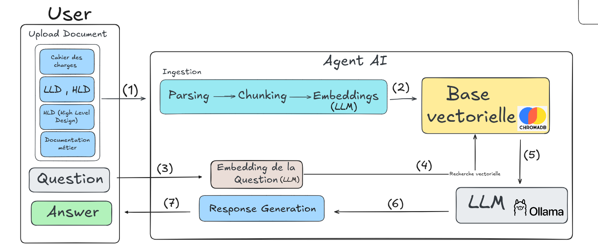

# GoRules - Document-Based Question Answering Assistant

A **Retrieval Augmented Generation (RAG)** system that leverages local LLMs to answer questions about your documents. Process PDFs and DOCX files, store embeddings in a vector database, and get intelligent answers using Ollama.

---



## 🎯 Features

- **Multi-format Support**: Process PDF and DOCX documents
- **Vector Search**: Semantic search with ChromaDB vector database
- **Local LLM**: Integration with Ollama for private, offline inference
- **Multiple Interfaces**:
  - 🌐 **Web UI**: Streamlit interactive interface
  - 🔌 **REST API**: FastAPI backend with streaming responses
  - 💻 **CLI**: Command-line interface for batch operations
- **Smart Chunking**: Configurable document segmentation with overlap
- **Streaming Responses**: Real-time query responses

---

## 📋 Prerequisites

Before starting, ensure you have:

1. **Python 3.8+**
2. **Ollama** installed and running locally
   - Download from: https://ollama.ai
   - Required models: `mistral:7b` (or your preferred LLM), `mxbai-embed-large` (embeddings)
   - Default: Ollama runs on `http://localhost:11434`

3. **Git** (for version control)

---

## 🚀 Installation

### 1. Clone the Repository

```bash
git clone <repository-url>
cd GoRules
```

### 2. Create Virtual Environment

**Using venv:**
```bash
python3 -m venv venv
source venv/bin/activate  # On Windows: venv\Scripts\activate
```

**Using conda:**
```bash
conda create -n gorules python=3.10
conda activate gorules
```

### 3. Install Dependencies

```bash
pip install -r requirements.txt
```

### 4. Configure Environment Variables

Copy the example configuration:
```bash
cp .env.exemple .env
```

Edit `.env` with your settings:

```env
# Ollama Configuration
OLLAMA_BASE_URL=http://localhost:11434
LLM_MODEL=mistral:7b           # Your LLM model name
EMBEDDING_MODEL=mxbai-embed-large  # Embedding model

# Database Configuration
CHROMA_DIR=./chroma_data       # Vector DB storage path

```

---

## 🔧 Setup Ollama

### 1. Start Ollama Service

```bash
# On most systems
ollama serve

# Or run in background
nohup ollama serve > ollama.log 2>&1 &
```

### 2. Pull Required Models

In a new terminal:

```bash
# Download LLM (this takes time - ~5GB for mistral:7b)
ollama pull mistral:7b

# Download embedding model
ollama pull mxbai-embed-large

# Verify models are loaded
ollama list
```

---

## 📁 Project Structure

```
GoRules/
├── main.py                 # FastAPI REST API server
├── streamlit_app.py       # Streamlit web interface
├── requirements.txt       # Python dependencies
├── .env.exemple          # Example environment variables
│
├── src/
│   ├── ask.py            # CLI tool for querying
│   ├── config.py         # Configuration settings
│   ├── ingest_doc.py     # Document ingestion pipeline
│   ├── prompt.py         # LLM system prompts
│   ├── store.py          # ChromaDB vector store interface
│   │
│   ├── agents/
│   │   ├── agent.py      # LLM interaction (ask, ask_stream)
│   │   ├── base.py       # Base agent classes
│   │
│   ├── ingestion/
│   │   ├── parsing.py    # PDF/DOCX parsing
│   │   ├── chunking.py   # Document chunking
│   │   └── embedding.py  # Vector embedding
│   │
│
└── chroma_data/          # Vector database (auto-created)
```

---

## 🎯 Usage Guide

### 1️⃣ **Streamlit Web Interface** (Recommended for Users)

Launch the interactive web application:

```bash
streamlit run streamlit_app.py
```

- Opens at: `http://localhost:8501`
- Upload documents
- Ask questions in chat interface
- View source documents and answers

---

### 2️⃣ **FastAPI REST API** (For Integration)

Start the API server:

```bash
uvicorn main:app --reload --host 0.0.0.0 --port 8000
```

**API Base URL**: `http://localhost:8000`

**Available Endpoints:**

#### Health Check
```bash
curl http://localhost:8000/health
```

#### List Projects
```bash
curl http://localhost:8000/projects
```

#### Query Documents
```bash
curl -X POST http://localhost:8000/projects/default/query \
  -H "Content-Type: application/json" \
  -d '{
    "question": "What is the main topic?",
    "top_k": 6
  }'
```

#### Upload Document
```bash
curl -X POST http://localhost:8000/projects/default/upload \
  -F "file=@document.pdf"
```

#### Get Documents in Project
```bash
curl http://localhost:8000/projects/default/documents
```

#### Stream Query Response
```bash
curl -N "http://localhost:8000/projects/default/stream?question=Your%20question"
```

See `main.py` for complete API documentation.

---

### 3️⃣ **CLI Tool** (For Batch Operations)

Query documents from command line:

```bash
python src/ask.py "Your question here"
```

Options:
```bash
python src/ask.py "question" --project my_project --top-k 5
```

## ⚙️ Configuration

### Modify Chunk Size and Overlap

Edit `src/config.py`:

```python
CHUNK_SIZE_WORDS = 120      # Adjust chunk size
CHUNK_OVERLAP_WORDS = 20    # Overlap between chunks
```

### Change LLM or Embedding Model

Update `.env`:

```env
LLM_MODEL=llama2:13b
EMBEDDING_MODEL=nomic-embed-text
```

---

## 🐛 Troubleshooting

### Issue: Connection refused to Ollama

**Solution**: Ensure Ollama is running
```bash
ollama serve
```

Check connection:
```bash
curl http://localhost:11434/api/tags
```

### Issue: Model not found

**Solution**: Pull required model
```bash
ollama pull mistral:7b
```

### Issue: Vector DB not found

**Solution**: Database is created on first ingestion. Ensure `CHROMA_DIR` path exists and is writable.

### Issue: Out of memory

**Solution**: Reduce `CHUNK_SIZE_WORDS` or use a smaller LLM model in `.env`

---

## 📊 Performance Tips

1. **For CPU-only**: Use smaller models like `mistral:7b` or `neural-chat`
2. **For GPU**: Increase `top_k` in queries for better results
3. **For faster responses**: Reduce `CHUNK_SIZE_WORDS` (trade-off with quality)
4. **For production**: Use separate Ollama instance with dedicated resources

---

## 📝 Development

### Project Requirements

- FastAPI >= 0.110
- Streamlit >= 1.33
- ChromaDB >= 0.5
- pypdf >= 4.3
- python-docx >= 1.1
- requests >= 2.31

### Adding New Features

1. Create feature branch: `git checkout -b feature/your-feature`
2. Make changes and test
3. Commit: `git commit -m "Add your feature"`
4. Push: `git push origin feature/your-feature`

---

## 📄 Environment Variables Reference

| Variable | Default | Description |
|----------|---------|-------------|
| `OLLAMA_BASE_URL` | `http://localhost:11434` | Ollama server URL |
| `LLM_MODEL` | `mistral:7b` | Language model name in Ollama |
| `EMBEDDING_MODEL` | `mxbai-embed-large` | Embedding model in Ollama |
| `CHROMA_DIR` | `./chroma_data` | Vector database directory |
| `OPENAI_API_KEY` | - | Optional: OpenAI API key |

---

## 📞 Support & Contributing

For issues or contributions, please:

1. Check existing issues
2. Create detailed bug reports
3. Submit pull requests with clear descriptions

---

## 📄 License

This project is part of the Inetum internship program.

---

## 🚀 Quick Start (Tl;DR)

```bash
# 1. Setup
python3 -m venv venv
source venv/bin/activate
pip install -r requirements.txt
cp .env.exemple .env

# 2. Start Ollama (in new terminal)
ollama serve

# 3. Pull models (in new terminal)
ollama pull mistral:7b
ollama pull mxbai-embed-large

# 4. Launch GoRules (choose one):

# Option A: Web Interface
streamlit run streamlit_app.py

# Option B: REST API
uvicorn main:app --reload

# Option C: CLI
python src/ask.py "your question"
```

Done! 
